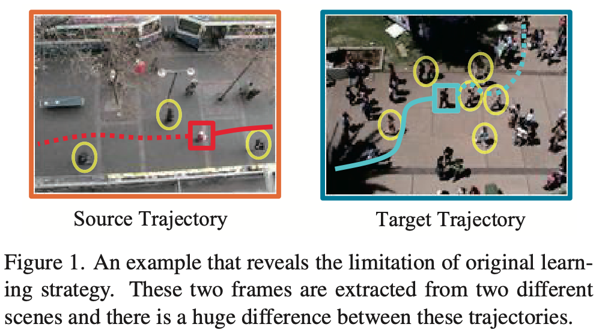
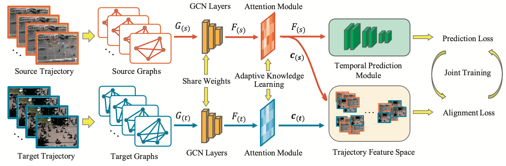

# [Adaptive Trajectory Prediction via Transferable GNN](https://arxiv.org/abs/2203.05046)

This readme file is an outcome of the [CENG502 (Spring 2023)](https://ceng.metu.edu.tr/~skalkan/ADL/) project for reproducing a paper without an implementation. See [CENG502 (Spring 20223) Project List](https://github.com/CENG502-Projects/CENG502-Spring2023) for a complete list of all paper reproduction projects.

# 1. Introduction
Puplished at *CVPR 2022*\
`Authors:`
Yi Xu, Lichen Wang, Yizhou Wang, Yun Fu

My goal in this project is to reproduce the ade/fde results for only some of the source-target domain pairs shared in Tables 2,3 and 6 in the paper. As explanined in the experimental settings, I will be treating each scene as one trajectory domain and the reproduced model is trained on only one domain and tested on another domain.

## 1.1. Paper summary
`Aim:` Predict the future trajectory seconds to even a minute prior from a given trajectory history.

> **Drawbacks of previous methods**
> * Existing methods usually assume the training and testing motions follow the same pattern while ignoring the potential distribution differences, they argue that this learning strategy has some limitations.

 

- The original strategy is to learn these two samples together without considering distribution differences, which introduces domain-bias and disparities into the model.
- The basic idea is to minimize the distance of distributions of source and target domains via some distance measures but the most popular domain adaptation approaches are not applicable here since there is no general feature to utilize. Instead a “sample” in this task is a combination of multiple trajectories with different pedestrians.

> **What is proposed to address this issue**
> * They propose a transferable graph neural network via adaptive knowledge learning `Transferable Graph Neural Network (T-GNN)`. 
> Which jointly conducts trajectory prediction as well as domain alignment in a unified framework. Specifically, a domain-invariant GNN is proposed to explore the structural motion knowledge where the domain-specific knowledge is reduced.

@TODO: Summarize the paper, the method & its contributions in relation with the existing literature.

# 2. The method and my interpretation

## 2.1. The original method
@TODO: Explain the original method.

- Given one pedestrian with observed trajectory, the aim is to predict the future trajectory.
	- The goal is to predict trajectories of all the pedestrians simultaneously.

**Spatial-Temporal Feature Representations**
- Different from traditional time series forecasting, it is more challanging to predict pedestrian future trajectories `because of the implicit human-human interactions` and their strong temporal correlations.
- So GNN is used to model those interactions.
- Before constructing the graph. coordinates of all pedestrians are firstly passed through `decentralization` layer, which eliminates the effects of scene size differences. Where i represents the pedestrian id, $o_{obs}^i$ represents location of pedestrian i at obs time, N is the total number of pedestrians in the scene. $$ o_t^{'i} = o^i_t - \frac{1}{N} \sum_{i=1}^N o_{obs}^i$$

- Graph Definition and Model
	- $G_t = (V_t, E_t, F_t)$ 
		- $V_t$: $\{v_{t;i}|i=1,...,N \}$ Vertex set of pedestrians
		- $E_t$: $\{e_{t;i,j}|i,j=1,...,N \}$ Edge set that indicates the releationship between two pedestrians
        - $F_t$: $\{f_{t;i}|i=1,...,N \} \in \mathbb{R}^{N \times D_f}$ Feature matrix associated with each pedestrian.
			- The value of $f_t;i$ is defined as; $$f_{t;i} = \sigma((x^{'i}_t, y^{'i}_t);W_0)$$
			- Where $W_0 \in \mathbb{R}^{2 \times D_f}$, projection matrix, non-linearity is ReLU.
        - We have also adjacency matrix $A_t \in \mathbb{R}^{N \times N}$ Initialized as the distances between pedestrians $i$ and $j$ $$a_{t;i,j} = ||o^{'i}_t - o^{'j}_t||_2$$
		    - They argue that this L2 distance is more appropriate.

        - Graph Attention Network is used, attention coefficients are calculated as; $$\alpha_{t;i,j} = \frac{exp(\phi(\boldsymbol{W_l}[\boldsymbol{a}_{t;i} \bigoplus \boldsymbol{a}_{t;j}]))}{\sum_{j=1}^N exp(\phi(\boldsymbol{W_l}[\boldsymbol{a}_{t;i} \bigoplus \boldsymbol{a}_{t;j}]))}$$
            - $\boldsymbol{a}_{t;i} \in \mathbb{R}^{N \times 1}$  is $i^{th}$ column vector in $A_t$ 
            - $\boldsymbol{W}_l \in \mathbb{R}^{1 \times 2N}$: Learnable parameters
            - $\bigoplus$: Represents concatenation, in row
            - $\phi$: LeakyReLU with $\theta = 0.2$ 
        - Linear combination $p_{t;i}$ computed as; $$p_{t;i} = \sigma \bigg( \sum_{j=1}^N \alpha_{t;i,j} \boldsymbol{a}_{t;j} \bigg)$$
		    - With each `column vector` $p_{t;i}$ concatenated together, we obtain the new updated adjacency matrix $A_t'$, `which contains the information of global spatial features of pedestrians at time step t`
        - GCN Layers ($l=3$), we stack matrices from time step $T_1$ to $T_{obs}$
            - $\hat{A} = \{ \hat{A}_1,\hat{A}_2,..., \hat{A}_{obs}\} \in \mathbb{R}^{N \times N\times L_{obs}}$  
            - $F^{(l)} = \{ F^{(l)}_1,F^{(l)}_2,...,F^{(l)}_{obs}, \} \in \mathbb{R}^{N \times D_f \times L_{obs}}$ 
            - Finaly the output the $(l+1)^{th}$ layer is calculated as, $$F^{(l+1)} = \sigma \big( D^{-\frac{1}{2}} \hat{A} D^{\frac{1}{2}} F^{(l)} \boldsymbol{W}^{(l)} \big)$$
	    - `Both source and target trajectories are constructed as graphs accordingly and then fed into the parameter-shared GCN layers for feature representation extraction.`

## 2.2. Our interpretation 

@TODO: Explain the parts that were not clearly explained in the original paper and how you interpreted them.

# 3. Experiments and results

## 3.1. Experimental setup

@TODO: Describe the setup of the original paper and whether you changed any settings.

## 3.2. Running the code

@TODO: Explain your code & directory structure and how other people can run it.

## 3.3. Results

@TODO: Present your results and compare them to the original paper. Please number your figures & tables as if this is a paper.

# 4. Conclusion

@TODO: Discuss the paper in relation to the results in the paper and your results.

# 5. References

@TODO: Provide your references here.

# Contact

@TODO: Provide your names & email addresses and any other info with which people can contact you.
