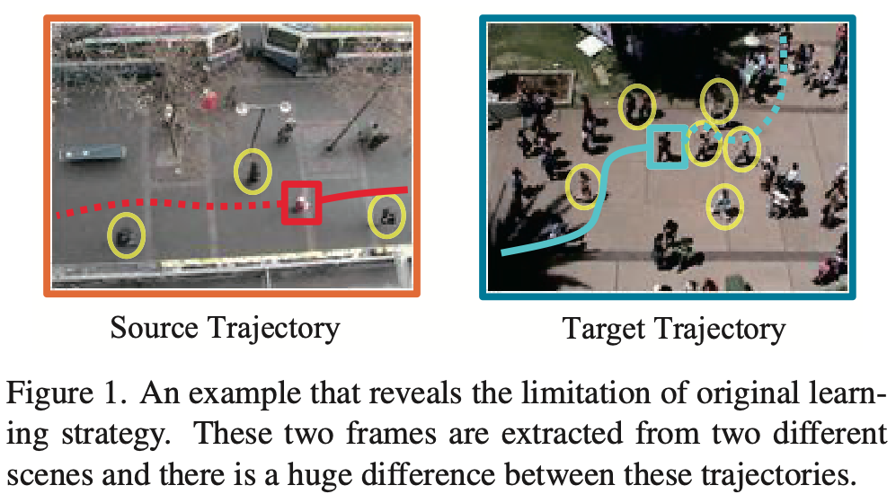
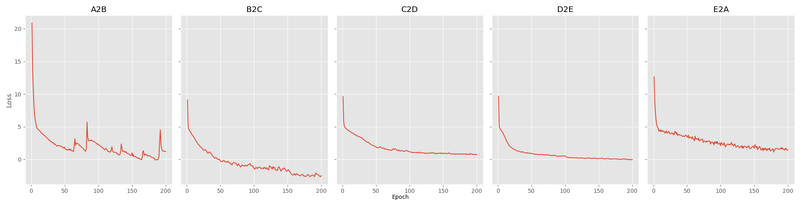
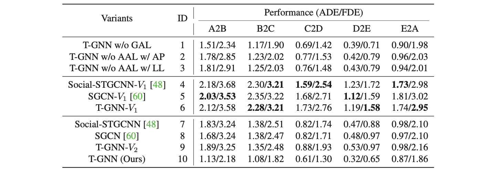

# [Adaptive Trajectory Prediction via Transferable GNN](https://arxiv.org/abs/2203.05046)
# 1. Introduction
Puplished at *CVPR 2022*\
`Authors:`
Yi Xu, Lichen Wang, Yizhou Wang, Yun Fu

My goal in this project is to reproduce the ade/fde results for only some of the source-target domain pairs shared in Tables 2,3 and 6 in the paper. As explanined in the experimental settings, I will be treating each scene as one trajectory domain and the reproduced model will be trained on only one domain and tested on another domain.


## 1.1. Paper summary
`Aim:` Predict the future trajectory seconds to even a minute prior from a given trajectory history.


> **Drawbacks of previous methods**
> * Existing methods usually assume the training and testing motions follow the same pattern while ignoring the potential distribution differences, they argue that this learning strategy has some limitations.

<br>

<p align="center"></p>

- The original strategy is to learn these two samples together without considering distribution differences, which introduces domain-bias and disparities into the model.
- The basic idea is to minimize the distance of distributions of source and target domains via some distance measures but the most popular domain adaptation approaches are not applicable here since there is no general feature to utilize. Instead a “sample” in this task is a combination of multiple trajectories with different pedestrians.

> **What is proposed to address this issue**
> * They propose a transferable graph neural network via adaptive knowledge learning `Transferable Graph Neural Network (T-GNN)`. 
> Which jointly conducts trajectory prediction as well as domain alignment in a unified framework. Specifically, a domain-invariant GNN is proposed to explore the structural motion knowledge where the domain-specific knowledge is reduced.


# 2. The method and my interpretation

## 2.1. The original method

- Given one pedestrian with observed trajectory, the aim is to predict the future trajectory.
	- The goal is to predict trajectories of all the pedestrians simultaneously.

<p align="center"></p>

**Spatial-Temporal Feature Representations**
- Different from traditional time series forecasting, it is more challanging to predict pedestrian future trajectories `because of the implicit human-human interactions` and their strong temporal correlations.
- So GNN is used to model those interactions.
- Before constructing the graph. coordinates of all pedestrians are firstly passed through `decentralization` layer, which eliminates the effects of scene size differences. Where i represents the pedestrian id, $o_{obs}^i$ represents location of pedestrian i at obs time, N is the total number of pedestrians in the scene. $$o_t^{'i} = o^i_t - \frac{1}{N} \sum_{i=1}^N o_{obs}^i$$


**Graph Definition and Model**

- For each time step, one graph is constructed $G_t = (V_t, E_t, F_t)$. Each vertex represents one pedestrian at time t, and edge set indicates relationship associated with each pedestrian. For each vertex a feature vector (x,y locations) is association. For the same scene (from 0 to T_obs) those graphs are concatenated to form spatio-temporal graph representation.

- We have also adjacency matrix $A_t \in \mathbb{R}^{N \times N}$ Initialized as the distances between pedestrians $i$ and $j$. They argue that this L2 distance is more appropriate. $$a_{t;i,j} = ||o^{'i}_t - o^{'j}_t||_2$$
    - To measure the relative importance of dynamic spatial relations between pedestrians, the graph attention layer is adopted here to update the adjacency matrix $A_t$. 

    - Graph Attention Network is used, attention coefficients are calculated as; 
    $$\alpha_{t;i,j} = \frac{exp(\phi(W_l[a_{t;i} \bigoplus a_{t;j}]))}{\sum_{j=1}^N exp(\phi(W_l [a_{t;i} \bigoplus a_{t;j}]))}$$
    - Linear combination $p_{t;i}$ computed as; $$p_{t;i} = \sigma \bigg( \sum_{j=1}^N \alpha_{t;i,j} \boldsymbol{a}_{t;j}\bigg)$$
        - With each `column vector` $p_{t;i}$ concatenated together, we obtain the new updated adjacency matrix $A_t'$, `which contains the information of global spatial features of pedestrians at time step t`
- GCN Layers ($l=3$), we stack matrices from time step $T_1$ to $T_{obs}$ and output layer is calculated as $$F^{(l+1)} = \sigma \big( D^{-\frac{1}{2}} \hat{A} D^{\frac{1}{2}} F^{(l)} \boldsymbol{W}^{(l)} \big)$$
- `Both source and target trajectories are constructed as graphs accordingly and then fed into the parameter-shared GCN layers for feature representation extraction.`

**Attention Based Adaptive Learning**
- Different from conventional domain adaptation situations the feature space of trajectory sample is not fixed as the number of pedestrians are different in source and target trajectory domains. 
- In order to address this misalignment problem, they propose a novel attention-based adaptive knowledge learning module to refine and effectively concentrate on the most relevant feature space for misalignment alleviation. Since one pedestrian’s feature vector cannot represents the whole trajectory domain. Therefore, an attention module is introduced to learn the relative relevance between feature vectors and trajectory domain.


1. For individual-wise attention, we first reformat the final feature representations $F_{(s)}$ and $F_{(t)}$ as 
	- $F_{(s)} = \big[ f_{(s)}^1, f_{(s)}^2, ..., f_{(s)}^{N^s} \big], f_{(s)}^i \in \mathbb{R}^{D_f \times L_{obs}}$
	- $F_{(t)} = \big[ f_{(t)}^1, f_{(t)}^2, ..., f_{(t)}^{N^t} \big], f_{(t)}^i \in \mathbb{R}^{D_f \times L_{obs}}$
2. Reshape those feature maps $f_{(s)}$ to vector of size $\mathbb{R}^{D_v}$, where $D_v = D_f \times L_{obs}$ 
3. $`\beta _{(s)}^i = \frac{exp(h^T\ tanh(W_ff^i_{(s)}))}{\sum_{j=1}^{N^s} exp(h^T\ tanh(W_ff^i_{(s)}))}`$
4. Final feature representations of source and target trajectory domains $c_{s} \in \mathbb{R}^{D_v}$ and $c_{t} \in \mathbb{R}^{D_v}$ are calculated as $`c_{(s)} \sum_{i=1}^{N^s} (\beta_{(s)}^i f_{(s)}^i)`$ and $`c_{(t)} \sum_{i=1}^{N^t} (\beta_{(t)}^i f_{(t)}^i)`$
5. Similarity Loss for distribution alignment is calculated as $`\mathcal{L}_{align} = \frac{1}{D_f} || c_{(s)} - c_{(t)} ||_2^2`$

**Temporal Prediction Module**
- Instead of making predictions frame by frame, TCN layers are employed to make future trajectory predictions based on the spatial-temporal feature representations F(s) from source trajectory domain.
- This prediction strategy is able to alleviate the error accumulating problem in sequential predictions caused by RNNs. It can also avoid gradient vanishing or reduce high computational costs.
- Formally in TCB layer we have $`F^{(l+1)}_{(s)} = TCN(F^{(l)}_{(s)};W_t^{(l)})`$
    - $`F^{(l+1)} \in \mathbb{R}^{N^s \times D_f \times L_{pred}}`$ 
- An assumption is made that pedestrian coordinates follow a bivariate Gaussian distribution. So the model outputs 5 scalar namely; mean_x, mean_y, std_x, std_y and correlation coefficient.

**Objective Function**
- Consists of two terms
    1. Prediction Loss (negative log-likelihood)
    2. Alignment Loss
- Whole model is trained with $`\mathcal{L} = \mathcal{L}_{pre} + \lambda \mathcal{L}_{align}`$


## 2.2. Our interpretation 


1. In the above section I have explain in `Graph definition and model` that the adjacency matrix is updated using graph attention network. The adjacency matrix for a particular frame has a shape of NxN, where N is the number of pedestrians exists on the scene at time t. That N changes as scene changes, so it is not clear how can we perform weight-shared attention model with a learnable parameter W with a shape of 1x2N, when N is not constant. 
    - So to solve this problem I use larger N as the maximum number of pedestrians that can exists on any scene, then for a scene with smaller number of pedestrians I zero pad the adjacancy matrix. Graph attention network is performed on zero padded Adjacancy matrix and the the portion of the new adjacency matrix is returned (A_new = A_padded[:num_pedestrians, :num_pedestrians])

2. In `Attention Based Adaptive Learning` part it is said that the single pedestrian is not representative for the whole trajectory and each iteration mostly we have very few number of pedestrians exists on the scene, but we also need to use the allignment loss while updating the model. So it was not clear to me when this loss is calculated. Because to obtain a representative feature vector of the trajectory domain, we should observe as much as pedestrians as we could.
    - To address this, a logical approach would be to calculate the alignment loss at the end of each batch. In each iteration, the feature representations of each pedestrian can be collected before passing them to the temporal prediction module. By doing so, the alignment loss can be computed based on the gathered feature representations at the end of the batch. It is important to note that in the context of graph-structured data, the concepts of batch and iteration do not directly correspond to each other. Since only one graph can be processed at a time in this model, each iteration would involve processing one graph. Therefore, collecting the feature representations of all pedestrians within an iteration and calculating the alignment loss at the end of the batch would allow for a more comprehensive and representative feature vector of the trajectory domain.

3. The explanation of the decentralization operation in the `Spatial-Temporal Feature Representations` section was found to be unclear. To gain a better understanding, additional references were consulted to explore the usage of this strategy. The provided equation for the decentralization operation was implemented; however, the results obtained were not as favorable as those achieved by employing the relative differences between coordinates, a common approach adopted by many previous methods.

# 3. Experiments and results

## 3.1. Experimental setup

Setup of the original paper,
- 8 frames are observed, 12 frames are predicted
- Number of GCN layers = 3
- Number of TCN layers = 3
- Feature Dimension = 64
- Batch Size = 16
- $`\lambda = 1`$ 
- Epoch = 200
- Optimizer = Adam
- Initial Learning Rate = 0.001 and changed to 0.0005 after 100 epochs
- In inference
    - 20 predicted trajectories are sampled and the best among 20 predictions is used for evaluations.\
`Note:` I have only changed the batch size, and use 32 to observe as much as pedestrians before calculating the alignment loss to better represent the trajectory domains.

## 3.2. Running the code

1.  Overall, the expected folder structure is:
```
├── dataset
    ├── A
    │   ├── A_B
    │   │   ├── test
    │   │   │   └── biwi_hotel.txt
    │   │   ├── train
    │   │   │   └── biwi_eth_train.txt
    │   │   └── val
    │   │       └── biwi_hotel_val.txt
    │   ├── ...
    ├── ...
├── experiments
    └── training
        ├── 1
        │   ├── checkpoints
        │       └── epoch_200.pth
        │   ├── config.json
        │   ├── ...
        └── ...
├── t_gnn_lib
    ├── dataset.py
    ├── __init__.py
    ├── model.py
    ├── train_helpers.py
    └── utils.py
├── README.md
├── test_script.py
├── train_script.py
├── train_config.yml
```
2. Create an Anaconda environment for this project:
```
conda env create -f environment.yml
conda activate py_cuda
```
3. The training process is initiated by running the train_script.py file, while the specific model parameters are adjusted within the training_config.yml file. Upon completion of the training, the relevant files associated with that particular run are saved under a unique ID within the experiments/ folder. To test the trained model, inside `test_script.py` there is configuration function, provide the run ID and the epoch ID and run the script.

## 3.3. Results

<p align="center"></p>
<p align="center">Figure 3: Training Loss of each Experiment </p>

<p align="center"></p>
<p align="center">Figure 4: Original Paper Results </p>

|         |     A2B   | B2C       | C2D       | D2E   | E2A |
|-------  |-----------|-----------|---------- |-------|------|
|ade/fde  | 3.49/3.8  | 2.28/2.99 | 1.62/1.89 | 1.05/1.54  | 3.48/2.97 |
<p align="center">Table 1: Reproduced Results </p>


`Comparison:` The results obtained from the reproduction of the model exhibit a noticeable discrepancy when compared to the original results. While the reproduced results are not entirely unfavorable, they do indicate that the model is learning. However, it is important to acknowledge the possibility of missing implementation details or misunderstandings that may have influenced the outcome. And also, it is mentioned in the experimental setting of the paper that the model is trained on `only one` domain and tested on other domains. So the amount of data that model consumes is very limited in this setup, if I understood correctly.

# 4. Conclusion

- The main reason for the discrepancies in the results may come from assumptions made during the implementation of parts that were not clearly explained. It is possible that there was a misunderstanding of the decentralization operation or a missed detail. To test the effect of the decentralization operation, I also applied it to another trajectory prediction model called Social-STGCNN. Surprisingly, the results indicated that the decentralization operation performed poorly compared to the use of relative coordinates in that model. However, it should be noted that using the decentralization operation still produced better results than using raw coordinates of pedestrians.

- Furthermore, the original paper lacked sufficient explanations for updating the adjacency matrix with a graph attention network. To address this issue, I developed a solution as described in section 2.2 of my work. Although this solution led to improved ade/fde results, they were not comparable to the original results reported in the paper.

In summary, the discrepancies in the results can be attributed to assumptions made during implementation, potential misunderstandings of certain operations, and the lack of detailed explanations in the original paper.

# 5. References

- I borrowed the negative log likelihood loss for bivariate Gausssian assumption from below.
    - https://github.com/abduallahmohamed/Social-STGCNN
- For dataloader, I refer to the repository below
    - https://github.com/agrimgupta92/sgan
- For temporal prediction module, I refer to,
    - https://arxiv.org/abs/1803.01271
    - https://arxiv.org/abs/1801.07455

# Contact

* Halil Çağrı Bilgi, cagri.bilgi@metu.edu.tr
